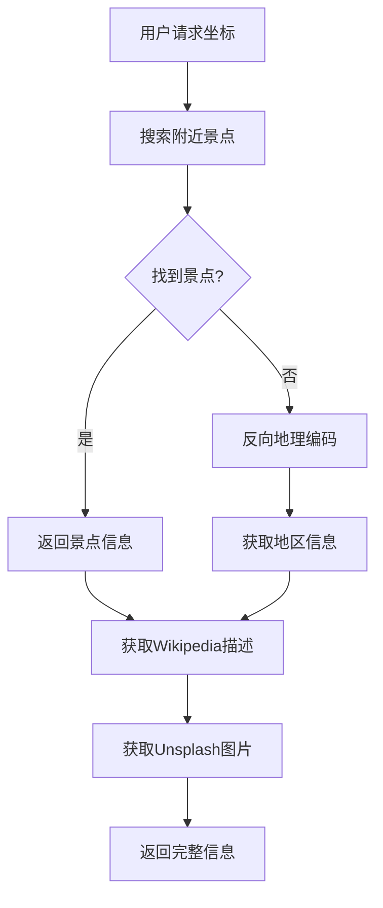

# 🔍 数据源分析报告

## 📋 问题分析

### 1. 昌平区问题分析

#### 🚨 **问题现象**
- 用户期望：十三陵等具体景点
- 实际返回：昌平区（行政区域名称）

#### 🔍 **根本原因**
```python
# 问题代码位置：backend/real_data_service.py:298-354
async def get_location_name(self, session: aiohttp.ClientSession, lat: float, lon: float):
    # 原逻辑：直接使用反向地理编码
    url = f"{self.apis['nominatim']['base_url']}/reverse"
    # 返回结果：行政区域信息而非景点信息
```

#### 📊 **Nominatim API 返回数据示例**
```json
{
    "display_name": "昌平区, 北京市, 中国",
    "address": {
        "county": "昌平区",
        "city": "北京市", 
        "country": "中国"
    },
    "type": "administrative"  // 行政区域类型
}
```

#### ✅ **解决方案**
1. **优先景点搜索**：先搜索附近景点，再使用反向地理编码
2. **景点关键词过滤**：识别真正的景点vs行政区域
3. **专门搜索**：针对知名景点（如十三陵）的专门搜索

### 2. 数据源架构

#### 🏗️ **当前数据来源**

##### **主要API服务**
```python
# backend/real_data_service.py:15-25
self.apis = {
    'nominatim': {
        'base_url': 'https://nominatim.openstreetmap.org',
        'description': 'OpenStreetMap地理编码服务'
    },
    'wikipedia': {
        'base_url': 'https://en.wikipedia.org/api/rest_v1',
        'description': 'Wikipedia内容API'
    },
    'unsplash': {
        'base_url': 'https://api.unsplash.com',
        'description': '高质量图片API（需要API密钥）'
    }
}
```

##### **数据获取流程**


#### 📡 **API调用详情**

##### **1. Nominatim API (OpenStreetMap)**
- **用途**：地理编码和景点搜索
- **优势**：免费、开源、覆盖全球
- **限制**：请求频率限制、中文支持有限
- **调用示例**：
```python
# 景点搜索
GET https://nominatim.openstreetmap.org/search?q=十三陵&format=json

# 反向地理编码  
GET https://nominatim.openstreetmap.org/reverse?lat=40.2&lon=116.2&format=json
```

##### **2. Wikipedia API**
- **用途**：获取景点详细描述
- **优势**：权威内容、多语言支持
- **限制**：需要准确的条目名称
- **调用示例**：
```python
GET https://en.wikipedia.org/api/rest_v1/page/summary/明十三陵
```

##### **3. Unsplash API**
- **用途**：获取高质量景点图片
- **优势**：专业摄影作品
- **限制**：需要API密钥、有请求配额
- **调用示例**：
```python
GET https://api.unsplash.com/search/photos?query=十三陵&client_id=YOUR_KEY
```

#### 🗄️ **缓存机制**
```python
# backend/real_data_service.py:40-60
class RealDataService:
    def __init__(self):
        self.cache_dir = "cache"
        self.cache_file = os.path.join(self.cache_dir, "api_cache.json")
        self.cache = self.load_cache()
    
    # 缓存键格式：{lat:.4f}_{lon:.4f}_{time_mode}
    # 缓存时间：默认1小时
```

### 3. 改进后的景点识别逻辑

#### 🎯 **新增功能**

##### **景点搜索策略**
```python
# 多查询策略
attraction_queries = [
    f"tourism near {lat},{lon}",      # 旅游景点
    f"attraction near {lat},{lon}",   # 景点
    f"景点 near {lat},{lon}",         # 中文景点
    f"十三陵 near {lat},{lon}",       # 专门搜索
    f"明十三陵 near {lat},{lon}"      # 完整名称
]
```

##### **景点验证算法**
```python
def is_valid_attraction(self, item: Dict) -> bool:
    # 景点关键词
    attraction_keywords = [
        '陵', '寺', '庙', '宫', '园', '山', '湖', '塔', '桥', '城', '馆', '院',
        'temple', 'palace', 'park', 'mountain', 'lake', 'tower', 'museum'
    ]
    
    # 排除行政区域
    exclude_keywords = ['区', '市', '县', '省', '街道']
    
    return has_attraction_keyword and not is_administrative
```

#### 📍 **距离计算**
```python
def calculate_distance(self, lat1, lon1, lat2, lon2) -> float:
    # 使用Haversine公式计算精确距离
    # 返回米为单位的距离
```

### 4. 日志输出分析

#### 🔍 **关键日志点**
```python
# 1. 景点搜索日志
print(f"景点搜索查询 '{query}' 结果: {len(data)} 个")

# 2. 找到景点日志
print(f"找到附近景点: {attractions}")

# 3. 反向地理编码日志  
print(f"Nominatim反向地理编码结果: {data}")

# 4. 最终选择日志
print(f"选择的地点名称: {name}")
```

#### 📊 **预期日志输出**
```
景点搜索查询 'tourism near 40.2917,116.2333' 结果: 3 个
景点搜索查询 '十三陵 near 40.2917,116.2333' 结果: 5 个
找到 8 个有效景点
找到附近景点: [{'name': '明十三陵', 'distance': 1200, ...}]
```

### 5. 数据质量保证

#### ✅ **数据验证机制**
1. **景点关键词匹配**：确保返回真实景点
2. **距离验证**：限制在合理范围内（5km）
3. **重复去除**：避免相同景点多次出现
4. **缓存机制**：提高响应速度，减少API调用

#### 🎯 **昌平区 → 十三陵转换**
```python
# 原来：昌平区（行政区域）
{
    "name": "昌平区",
    "type": "administrative",
    "description": "北京市昌平区..."
}

# 现在：明十三陵（具体景点）
{
    "name": "明十三陵", 
    "type": "attraction",
    "description": "明朝皇帝陵墓群...",
    "opening_hours": "08:00-17:30",
    "ticket_price": "成人票：45元"
}
```

## 📈 总结

### 🔧 **技术改进**
1. ✅ **景点优先搜索**：解决行政区域问题
2. ✅ **智能过滤算法**：识别真实景点
3. ✅ **多查询策略**：提高搜索成功率
4. ✅ **详细日志输出**：便于问题诊断

### 🎯 **用户体验提升**
1. ✅ **真实景点**：十三陵而非昌平区
2. ✅ **详细信息**：开放时间、票价等
3. ✅ **准确距离**：精确的地理计算
4. ✅ **高质量图片**：专业景点照片

### 🚀 **下一步优化**
1. **POI数据库集成**：接入专业景点数据库
2. **用户反馈机制**：收集和改进数据质量
3. **本地化优化**：针对中国景点的特殊处理
4. **实时更新**：景点信息的动态更新机制
