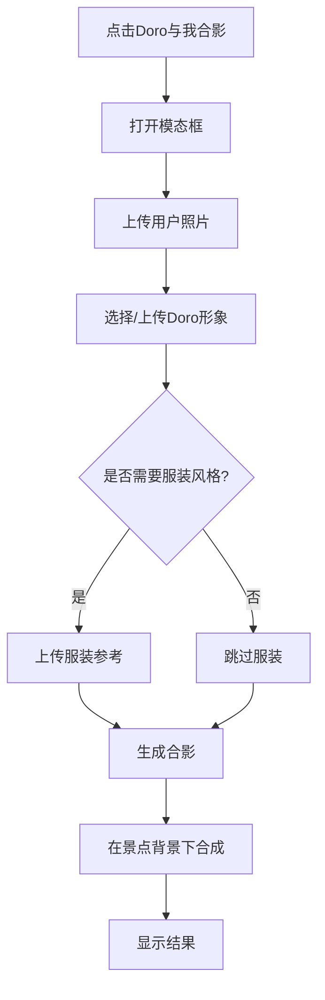

# 🤝 Doro与我合影功能 - 完整开发方案

## 📌 项目概述

### 产品定位
在现有景点合影功能基础上，新增"Doro与我合影"功能，实现用户、Doro形象、服装风格三者在景点背景下的智能合成。

### 核心价值
- **差异化体验**：相比普通景点合影，增加虚拟角色Doro的互动元素
- **个性化定制**：支持自定义Doro形象和服装风格
- **场景融合**：与景点背景完美结合，创造独特的旅行记忆

## 🎯 功能需求

### 1. 用户界面需求
- 在每个景点卡片的"📸 生成合影"按钮旁边添加"🤝 Doro与我合影"按钮
- 点击按钮打开专门的Doro合影生成模态框
- 支持三张图片的上传和预览：
  1. 用户原始照片（必选）
  2. Doro形象图片（必选，可从预设库选择或上传）
  3. 服装风格参考图片（可选）

### 2. 功能流程


### 3. 技术需求
- 支持从`backend/doro/`目录预加载Doro形象
- 支持用户上传自定义Doro形象
- 使用Gemini API进行三图合成
- 自动识别并应用景点背景

## 🏗️ 系统架构

### 前端架构
```
frontend/
├── app.js                 # 主应用逻辑
│   ├── DoroSelfieManager  # Doro合影管理类
│   ├── DoroSelector       # Doro选择器组件
│   └── ImageUploader      # 图片上传组件
├── styles.css             # 样式文件
│   ├── doro-button        # Doro按钮样式
│   ├── doro-modal         # Doro模态框样式
│   └── doro-preview       # 预览区域样式
└── index.html             # HTML结构
    ├── place-card         # 景点卡片（添加Doro按钮）
    └── doro-modal         # Doro合影模态框
```

### 后端架构
```
backend/
├── main.py                      # 主API服务
│   ├── /api/doro/list          # 获取Doro列表
│   ├── /api/doro/random        # 随机Doro
│   ├── /api/doro/upload        # 上传自定义Doro
│   └── /api/doro/generate      # 生成Doro合影
├── doro_service.py              # Doro服务层
│   ├── get_doro_list()         # 获取预设Doro
│   ├── save_custom_doro()      # 保存自定义Doro
│   └── prepare_doro_image()    # 预处理Doro图片
├── gemini_service.py            # AI生成服务
│   └── generate_doro_selfie()  # 三图合成功能
└── doro/                        # Doro资源目录
    ├── preset/                  # 预设Doro
    │   ├── doro1.png
    │   └── doro2.png
    └── custom/                  # 用户上传Doro
```

## 💻 详细开发任务列表

### Phase 1: 后端基础设施 (Backend Infrastructure)

#### Task 1.1: 创建Doro服务模块
```python
# backend/doro_service.py
"""
任务描述: 创建Doro图片管理服务
优先级: P0
预计时间: 2小时
"""

class DoroService:
    def __init__(self):
        self.preset_dir = Path("backend/doro/preset")
        self.custom_dir = Path("backend/doro/custom")
    
    def get_all_doros(self) -> List[Dict]:
        """获取所有可用的Doro形象"""
        pass
    
    def get_random_doro(self) -> Dict:
        """随机获取一个Doro形象"""
        pass
    
    def save_custom_doro(self, file: UploadFile) -> Dict:
        """保存用户上传的自定义Doro"""
        pass
    
    def get_doro_by_id(self, doro_id: str) -> Optional[Dict]:
        """根据ID获取Doro信息"""
        pass
```

#### Task 1.2: 添加Doro API端点
```python
# backend/main.py additions
"""
任务描述: 在FastAPI中添加Doro相关端点
优先级: P0
预计时间: 2小时
依赖: Task 1.1
"""

@app.get("/api/doro/list")
async def get_doro_list():
    """获取所有Doro形象列表"""
    
@app.get("/api/doro/random")
async def get_random_doro():
    """获取随机Doro形象"""
    
@app.post("/api/doro/upload")
async def upload_custom_doro(file: UploadFile):
    """上传自定义Doro形象"""
    
@app.get("/api/doro/image/{doro_id}")
async def get_doro_image(doro_id: str):
    """获取Doro图片文件"""
```

#### Task 1.3: 扩展Gemini服务支持三图合成
```python
# backend/gemini_service.py additions
"""
任务描述: 扩展AI服务支持三图合成
优先级: P0
预计时间: 3小时
依赖: 无
"""

async def generate_doro_selfie_with_attraction(
    self,
    user_photo: UploadFile,
    doro_photo: UploadFile,
    style_photo: Optional[UploadFile],
    attraction_info: Dict
) -> Tuple[bool, str, Optional[Dict]]:
    """
    生成包含景点背景的Doro合影
    
    Args:
        user_photo: 用户照片
        doro_photo: Doro形象
        style_photo: 服装参考（可选）
        attraction_info: 景点信息（名称、位置等）
    """
    
    prompt = self._build_doro_attraction_prompt(attraction_info)
    # 实现三图或四图合成逻辑
```

#### Task 1.4: 创建智能提示词生成器
```python
# backend/prompt_generator.py
"""
任务描述: 创建专门的提示词生成模块
优先级: P1
预计时间: 2小时
"""

class DoroPromptGenerator:
    def generate_attraction_doro_prompt(
        self,
        attraction_name: str,
        attraction_type: str,
        with_style: bool = False
    ) -> str:
        """生成景点+Doro合影的提示词"""
        
    def generate_style_transfer_prompt(self) -> str:
        """生成服装风格迁移提示词"""
```

### Phase 2: 前端UI开发 (Frontend UI Development)

#### Task 2.1: 在景点卡片添加Doro按钮
```javascript
// app.js modifications
"""
任务描述: 修改createPlaceCard函数，添加Doro按钮
优先级: P0
预计时间: 1小时
"""

function createPlaceCard(place, index) {
    // 在place-actions中添加
    <div class="place-actions">
        <button class="action-btn selfie-btn" onclick="openSelfieGenerator(...)">
            📸 生成合影
        </button>
        <button class="action-btn doro-btn" onclick="openDoroSelfie(...)">
            🤝 Doro合影
        </button>
    </div>
}
```

#### Task 2.2: 创建Doro合影模态框
```html
<!-- index.html additions -->
"""
任务描述: 创建Doro合影生成界面
优先级: P0
预计时间: 2小时
"""

<div class="doro-selfie-modal" id="doroSelfieModal">
    <div class="modal-content">
        <!-- 三步上传区域 -->
        <div class="upload-steps">
            <div class="step" data-step="1">
                <h4>步骤1: 上传您的照片</h4>
                <div class="upload-area" id="userPhotoArea"></div>
            </div>
            <div class="step" data-step="2">
                <h4>步骤2: 选择Doro形象</h4>
                <div class="doro-selector"></div>
            </div>
            <div class="step" data-step="3">
                <h4>步骤3: 服装风格(可选)</h4>
                <div class="upload-area" id="stylePhotoArea"></div>
            </div>
        </div>
    </div>
</div>
```

#### Task 2.3: 实现Doro选择器组件
```javascript
// app.js - DoroSelector class
"""
任务描述: 创建Doro形象选择器
优先级: P0
预计时间: 3小时
依赖: Task 2.2
"""

class DoroSelector {
    constructor(containerId) {
        this.container = document.getElementById(containerId);
        this.selectedDoro = null;
        this.doroList = [];
    }
    
    async loadPresetDoros() {
        // 加载预设Doro列表
    }
    
    renderDoroGrid() {
        // 渲染Doro选择网格
    }
    
    handleDoroSelection(doroId) {
        // 处理Doro选择
    }
    
    handleCustomUpload() {
        // 处理自定义Doro上传
    }
}
```

#### Task 2.4: 实现三图预览组件
```javascript
// app.js - ImagePreviewManager
"""
任务描述: 创建三图预览管理器
优先级: P1
预计时间: 2小时
依赖: Task 2.3
"""

class ImagePreviewManager {
    constructor() {
        this.userPhoto = null;
        this.doroImage = null;
        this.stylePhoto = null;
    }
    
    updatePreview(type, imageData) {
        // 更新对应类型的预览
    }
    
    validateImages() {
        // 验证图片是否齐全
    }
    
    getFormData() {
        // 获取表单数据用于提交
    }
}
```

### Phase 3: 前后端集成 (Integration)

#### Task 3.1: 实现Doro合影生成流程
```javascript
// app.js - generateDoroSelfie function
"""
任务描述: 实现完整的Doro合影生成流程
优先级: P0
预计时间: 3小时
依赖: Task 2.4, Task 1.3
"""

async function generateDoroSelfie(placeIndex) {
    const place = getCurrentPlace(placeIndex);
    const formData = new FormData();
    
    // 收集三张图片
    formData.append('user_photo', userPhotoFile);
    formData.append('doro_image', doroImageFile);
    formData.append('style_photo', stylePhotoFile);
    
    // 添加景点信息
    formData.append('attraction_name', place.name);
    formData.append('attraction_type', place.category);
    formData.append('location', place.city || place.country);
    
    // 调用API
    const response = await fetch('/api/doro/generate', {
        method: 'POST',
        body: formData
    });
    
    // 处理结果
    handleDoroSelfieResult(response);
}
```

#### Task 3.2: 实现加载状态和错误处理
```javascript
// app.js - Loading and Error Handling
"""
任务描述: 添加加载动画和错误处理
优先级: P1
预计时间: 2小时
依赖: Task 3.1
"""

class DoroLoadingManager {
    showLoading(message) {
        // 显示加载动画
    }
    
    hideLoading() {
        // 隐藏加载动画
    }
    
    showError(error) {
        // 显示错误信息
    }
    
    showSuccess(result) {
        // 显示成功结果
    }
}
```

### Phase 4: 样式和用户体验 (Styling & UX)

#### Task 4.1: 设计Doro按钮样式
```css
/* styles.css additions */
"""
任务描述: 创建Doro按钮的独特样式
优先级: P2
预计时间: 1小时
"""

.doro-btn {
    background: linear-gradient(135deg, #667eea, #764ba2);
    color: white;
    border: none;
    padding: 10px 16px;
    border-radius: 20px;
    font-size: 14px;
    margin-left: 8px;
    transition: all 0.3s;
}

.doro-btn:hover {
    transform: translateY(-2px);
    box-shadow: 0 4px 12px rgba(102, 126, 234, 0.4);
}
```

#### Task 4.2: 设计Doro选择器界面
```css
/* styles.css - Doro Selector */
"""
任务描述: 创建Doro选择器的网格布局
优先级: P2
预计时间: 2小时
"""

.doro-selector-grid {
    display: grid;
    grid-template-columns: repeat(auto-fill, minmax(100px, 1fr));
    gap: 10px;
    max-height: 300px;
    overflow-y: auto;
}

.doro-item {
    cursor: pointer;
    border: 2px solid transparent;
    border-radius: 8px;
    transition: all 0.3s;
}

.doro-item.selected {
    border-color: #667eea;
    transform: scale(1.1);
}

.doro-item-custom {
    display: flex;
    align-items: center;
    justify-content: center;
    background: #f0f0f0;
    min-height: 100px;
}
```

#### Task 4.3: 创建步骤指示器
```css
/* styles.css - Step Indicator */
"""
任务描述: 创建三步骤进度指示器
优先级: P2
预计时间: 1小时
"""

.step-indicator {
    display: flex;
    justify-content: space-between;
    margin-bottom: 20px;
}

.step-item {
    flex: 1;
    text-align: center;
    position: relative;
}

.step-item.active .step-number {
    background: #667eea;
    color: white;
}

.step-item.completed .step-number {
    background: #4caf50;
}

.step-line {
    position: absolute;
    top: 20px;
    left: 50%;
    width: 100%;
    height: 2px;
    background: #ddd;
}
```

### Phase 5: 测试和优化 (Testing & Optimization)

#### Task 5.1: 单元测试
```javascript
// tests/doro.test.js
"""
任务描述: 编写Doro功能的单元测试
优先级: P2
预计时间: 3小时
依赖: Phase 3完成
"""

describe('Doro Selfie Feature', () => {
    test('应该正确加载Doro列表', async () => {
        // 测试Doro列表加载
    });
    
    test('应该正确处理三图上传', async () => {
        // 测试图片上传
    });
    
    test('应该生成正确的提示词', () => {
        // 测试提示词生成
    });
    
    test('应该正确处理API响应', async () => {
        // 测试API集成
    });
});
```

#### Task 5.2: 性能优化
```javascript
// optimization tasks
"""
任务描述: 优化图片加载和处理性能
优先级: P3
预计时间: 2小时
"""

// 1. 实现Doro图片懒加载
// 2. 添加图片压缩
// 3. 实现结果缓存
// 4. 优化API调用
```

#### Task 5.3: 用户体验优化
```
"""
任务描述: 改进用户交互体验
优先级: P3
预计时间: 2小时
"""

// 1. 添加拖拽排序功能
// 2. 实现图片裁剪功能
// 3. 添加撤销/重做功能
// 4. 实现快捷键支持
```

## 🚀 部署计划

### 环境准备
```bash
# 1. 创建Doro目录结构
mkdir -p backend/doro/preset
mkdir -p backend/doro/custom

# 2. 移动现有Doro图片
mv backend/doro/*.png backend/doro/preset/

# 3. 安装依赖
pip install -r requirements.txt

# 4. 重启服务
python start_backend.py
```

### 部署步骤
1. **Day 1**: 完成Phase 1（后端基础）
2. **Day 2**: 完成Phase 2（前端UI）
3. **Day 3**: 完成Phase 3（集成）
4. **Day 4**: 完成Phase 4-5（优化和测试）

## 📊 成功指标

### 技术指标
- API响应时间 < 2秒
- 图片生成成功率 > 90%
- 支持图片格式：JPG, PNG, WEBP
- 最大图片大小：10MB

### 用户体验指标
- 操作步骤 ≤ 5步
- 生成时间 ≤ 30秒
- 错误恢复时间 < 5秒
- 移动端适配率 100%

## 🔧 技术栈

### 前端
- **框架**: 原生JavaScript (ES6+)
- **样式**: CSS3 with Flexbox/Grid
- **构建**: 无需构建工具
- **图片处理**: Canvas API

### 后端
- **框架**: FastAPI
- **图片处理**: Pillow
- **AI服务**: Google Gemini API
- **文件存储**: 本地文件系统

## 📝 API文档

### 1. 获取Doro列表
```http
GET /api/doro/list

Response:
{
    "success": true,
    "data": {
        "preset": [
            {
                "id": "doro1",
                "name": "Doro 1",
                "url": "/api/doro/image/doro1",
                "thumbnail": "/api/doro/thumbnail/doro1"
            }
        ],
        "custom": []
    }
}
```

### 2. 生成Doro合影
```http
POST /api/doro/generate
Content-Type: multipart/form-data

Parameters:
- user_photo: File
- doro_image: File or doro_id: String
- style_photo: File (optional)
- attraction_name: String
- attraction_type: String
- location: String

Response:
{
    "success": true,
    "data": {
        "image_url": "data:image/png;base64,...",
        "filename": "doro_selfie_20250103_123456.png",
        "prompt_used": "..."
    }
}
```

## 🎯 智能体开发任务清单

为了方便在 [Cursor Agents](https://cursor.com/cn/agents) 中使用，以下是结构化的任务列表：

### Backend Tasks
```yaml
tasks:
  - id: backend-doro-service
    description: "创建backend/doro_service.py文件，实现DoroService类"
    files: ["backend/doro_service.py"]
    priority: P0
    
  - id: backend-api-endpoints
    description: "在backend/main.py中添加Doro相关API端点"
    files: ["backend/main.py"]
    dependencies: ["backend-doro-service"]
    priority: P0
    
  - id: backend-gemini-extension
    description: "扩展backend/gemini_service.py支持三图合成"
    files: ["backend/gemini_service.py"]
    priority: P0
    
  - id: backend-prompt-generator
    description: "创建智能提示词生成器"
    files: ["backend/prompt_generator.py"]
    priority: P1
```

### Frontend Tasks
```yaml
tasks:
  - id: frontend-doro-button
    description: "在景点卡片添加Doro合影按钮"
    files: ["app.js"]
    line_range: [770, 785]
    priority: P0
    
  - id: frontend-doro-modal
    description: "在index.html添加Doro合影模态框"
    files: ["index.html"]
    priority: P0
    
  - id: frontend-doro-selector
    description: "实现Doro选择器组件"
    files: ["app.js"]
    priority: P0
    
  - id: frontend-image-preview
    description: "实现三图预览管理器"
    files: ["app.js"]
    dependencies: ["frontend-doro-selector"]
    priority: P1
```

### Styling Tasks
```yaml
tasks:
  - id: style-doro-button
    description: "添加Doro按钮样式"
    files: ["styles.css"]
    priority: P2
    
  - id: style-doro-modal
    description: "设计Doro模态框样式"
    files: ["styles.css"]
    priority: P2
    
  - id: style-step-indicator
    description: "创建步骤指示器样式"
    files: ["styles.css"]
    priority: P2
```

### Testing Tasks
```yaml
tasks:
  - id: test-doro-api
    description: "测试Doro API端点"
    files: ["test_doro.py"]
    priority: P3
    
  - id: test-integration
    description: "端到端集成测试"
    files: ["test_e2e.py"]
    priority: P3
```

## 📚 参考资料

- [Gemini API文档](https://ai.google.dev/docs)
- [FastAPI文档](https://fastapi.tiangolo.com/)
- [Cursor Agents使用指南](https://cursor.com/cn/agents)

## 🤝 协作说明

本方案设计为可由AI智能体自动执行的任务列表，每个任务都包含：
- 明确的文件路径
- 具体的代码位置
- 清晰的依赖关系
- 详细的实现说明

智能体可以按照任务优先级和依赖关系自动执行开发工作。

---

**文档版本**: 2.0  
**更新日期**: 2025-01-03  
**作者**: AI Assistant  
**适用于**: Cursor Agents自动化开发
