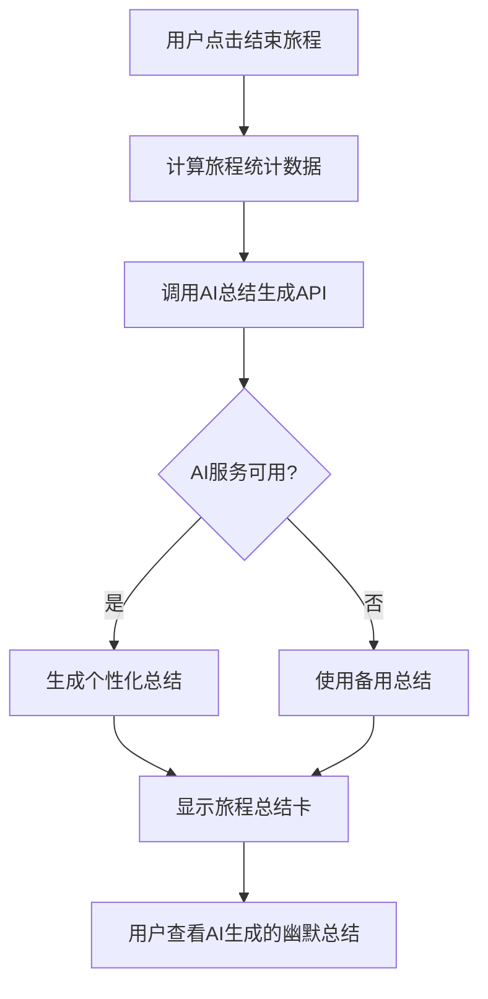

# 🤖 AI旅程总结功能

## 📋 功能概述

新增了智能旅程总结功能，当用户完成探索旅程时，系统会自动生成一段幽默轻松的AI总结文字，让旅程结束更加有趣和个性化。

## ✨ 功能特性

### 1. 智能文本生成
- **AI驱动**：基于Langchain框架的AI服务生成个性化总结
- **幽默风格**：采用轻松幽默的语调，让总结更有趣
- **个性化**：根据实际旅程数据（场景、距离、时长）定制内容

### 2. 视觉呈现
- **精美卡片**：总结文字显示在独立的半透明卡片中
- **毛玻璃效果**：现代化的backdrop-filter效果
- **响应式设计**：适配各种屏幕尺寸

### 3. 容错机制
- **优雅降级**：AI服务不可用时显示备用文字
- **快速响应**：30秒超时保证用户体验
- **错误处理**：完整的异常处理机制

## 🏗️ 技术实现

### 前端实现 (app.js)

#### 1. 旅程总结函数增强
```javascript
async function showJourneySummary(journeyResult) {
    // 生成AI总结文字
    const aiSummary = await generateAIJourneySummary(stats);
    
    // 在旅程总结卡中显示AI文字
    const summaryHtml = `
        <div class="ai-summary-text">
            🤖 AI旅程回顾
            ${aiSummaryText}
        </div>
    `;
}
```

#### 2. API调用函数
```javascript
async function generateAIJourneySummary(stats) {
    const response = await fetch('/api/journey-summary', {
        method: 'POST',
        body: JSON.stringify({
            visited_scenes: journeyManagement.historyScenes,
            total_distance: stats.totalDistance,
            journey_duration: `${stats.totalTimeMinutes}分钟`
        })
    });
}
```

### 后端实现 (main.py)

#### 1. 数据模型定义
```python
class JourneySummaryRequest(BaseModel):
    visited_scenes: List[Dict]
    total_distance: float
    journey_duration: str
    scenes_count: int

class JourneySummaryResponse(BaseModel):
    success: bool
    summary: str
    generation_time: float
    message: str
```

#### 2. API端点实现
```python
@app.post("/api/journey-summary")
async def generate_journey_summary(request: JourneySummaryRequest):
    ai_service = get_ai_service()
    summary_text = await ai_service.generate_journey_summary_ai(
        visited_scenes=request.visited_scenes,
        total_distance=request.total_distance,
        journey_duration=request.journey_duration
    )
    return JourneySummaryResponse(summary=summary_text)
```

### AI服务集成 (ai_service.py)

利用已有的Langchain集成，调用`generate_journey_summary_ai`方法：
- **智能提示词**：包含旅程详细信息
- **风格控制**：指定幽默轻松的语调
- **结构化输出**：确保生成内容格式一致

## 🎨 UI/UX设计

### 视觉效果
```css
.ai-summary-text {
    background: rgba(255, 255, 255, 0.15);
    border-radius: 15px;
    padding: 20px;
    backdrop-filter: blur(10px);
    border: 1px solid rgba(255, 255, 255, 0.2);
    font-style: italic;
    text-align: center;
}
```

### 用户体验
- **无感加载**：AI生成过程对用户透明
- **即时显示**：生成完成立即更新UI
- **降级友好**：失败时显示通用总结

## 📱 功能流程



## 🧪 测试验证

### 测试脚本
提供了完整的测试脚本 `test_journey_summary.py`:

```bash
python test_journey_summary.py
```

### 测试覆盖
- **基础功能测试**：验证API正常工作
- **多场景测试**：短途、长途不同旅程类型
- **错误处理测试**：网络异常、服务不可用等

### 测试结果示例
```
🎉 所有测试通过！AI旅程总结功能工作正常
📊 测试结果: 3/3 成功率: 100.0%
```

## 🎯 使用示例

### 短途旅程总结
> "🎉 哇！你刚刚完成了一次精彩的城市微探险！虽然只有2.1公里，但45分钟的城市广场漫步让你发现了都市生活的另一面。每一步都踏出了新的节拍，每一眼都看到了不同的风景。背包客的心永远年轻，距离不是问题，关键是探索的心情！🚶‍♂️✨"

### 长途探索总结  
> "🎊 天哪！你刚刚完成了一场史诗级的探索马拉松！156.7公里的距离，8个半小时的时间，5个截然不同的景点——从山峰到海滨，从寺庙到森林，这简直就是一部行走的地理纪录片！你的脚步丈量了大地的辽阔，你的眼睛见证了自然的神奇。这不是普通的旅行，这是传说中的'背包客终极挑战'！👑🏆"

## 🔧 配置要求

### 环境变量
```bash
# 启用Langchain AI服务
USE_LANGCHAIN=true

# OpenAI API配置
OPENAI_API_KEY=your_openai_api_key
OPENAI_MODEL=gpt-4o-mini
```

### 依赖包
- **前端**：无额外依赖（使用原生JavaScript）
- **后端**：已包含在现有的requirements.txt中

## 🚀 部署说明

### 开发环境
1. 确保AI服务配置正确
2. 启动后端服务：`python start_app.py`
3. 访问前端完成一次旅程即可体验

### 生产环境
1. 配置环境变量
2. 确保OpenAI API可访问
3. 监控AI服务调用频率和响应时间

## 🎉 功能亮点

### 用户体验
- **惊喜元素**：用户完成旅程时的意外惊喜
- **个性化**：每次总结都是独一无二的
- **娱乐性**：幽默的表达让用户会心一笑

### 技术价值
- **AI集成**：展示了Langchain框架的实际应用
- **架构优雅**：前后端分离，职责清晰
- **扩展性强**：可轻松添加更多AI功能

### 商业价值
- **用户粘性**：有趣的总结增加用户使用动机
- **分享传播**：用户更愿意分享有趣的AI总结
- **品牌特色**：体现产品的科技感和人文关怀

## 📝 后续扩展

### 可能的改进方向
1. **多语言支持**：支持不同语言的总结生成
2. **风格自定义**：让用户选择总结的风格（幽默、正式、诗意等）
3. **分享功能**：允许用户分享AI生成的总结到社交媒体
4. **历史回顾**：保存和查看历史旅程的AI总结
5. **个性化学习**：基于用户偏好优化总结风格

---

*功能开发完成时间: 2024年12月*  
*技术栈: JavaScript + FastAPI + Langchain + OpenAI*  
*开发者: AI助手 & 用户协作开发*
